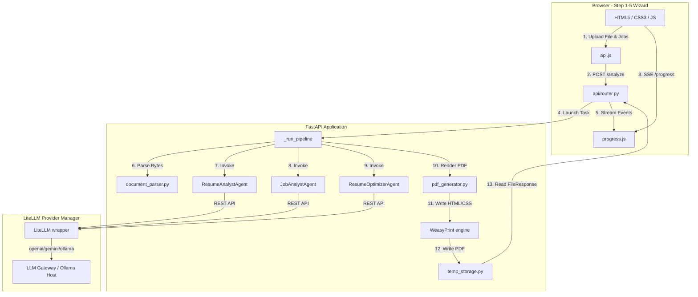

# System Architecture

The **ATS Optimizer** application is designed around a clean decoupling of the client interface (Vanilla ES6+ SPA) and backend services (FastAPI), running inside a unified Docker container environment.

## 1. Architectural Overview

## 2. Key Architecture Points
* **Asynchronous Execution Pattern**: The API router receives requests, immediately spins off a background task to process the pipeline, and returns a session token. The client then monitors the task state in real-time via Server-Sent Events (SSE).
* **Temporary State Storage**: Optimizations are session-scoped and stored inside `/tmp/{session_id}`. No database is required, and data is kept ephemeral.
* **LLM Abstraction Layer**: By using LiteLLM, the backend remains agnostic to the upstream provider, allowing developers to switch between OpenAI, Vertex AI, Gemini, or local gateways by simply altering environment variables.
